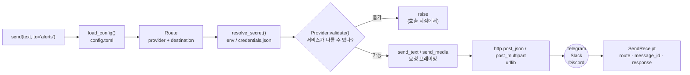
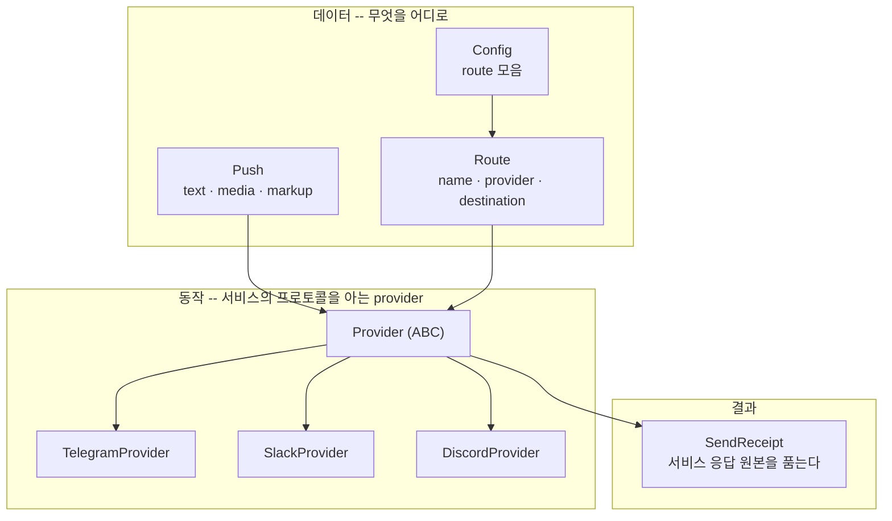

# pushpush

[English](README.md) | **한국어**

Telegram·Slack·Discord로 메시지를 보내는 파이썬 패키지. 텍스트와 파일 한 장을
보내고, 자주 쓰는 대상은 이름(route)으로 저장해두고 부른다.

```python
from pushpush import send

send("반도체 수급 급락 -- 확인 필요", to="alerts")
send(media="chart.png", caption="today", to="alerts")
```

Claude Code를 쓴다면 파이썬을 몰라도 말로 보낼 수 있다 → [Claude Code에서 쓰기](#claude-code에서-쓰기)

Windows·macOS·Linux에서 동작한다. 설치되는 것은 이 패키지뿐이고, 다른 라이브러리를
함께 끌어오지 않는다 -- 표준 라이브러리의 `urllib` 하나로 전송한다.

## 구조 한눈에

`send()` 한 번은 route를 풀고, secret을 찾고, provider가 요청을 짜고, 서비스가
못 받을 것은 네트워크를 타기 전에 막고, 결과를 `SendReceipt`로 돌려준다.



객체는 세 역할로 나뉜다 -- 구성하는 **데이터**, 보내는 **동작(provider)**, 돌아오는
**결과**. 새 서비스는 `Provider` 하위클래스 하나로 끝난다.



## 무엇을 어디로 보낼 수 있나

| 서비스 | 텍스트 | 파일 | 자격증명 |
|---|---|---|---|
| Telegram | O | O (사진·문서) | 봇 토큰 + chat_id |
| Discord | O | O (웹훅 첨부) | 웹훅 URL |
| Slack | O | 아직 안 됨 | 웹훅 URL 또는 봇 토큰(xoxb) |

Slack 파일 전송은 여러 단계를 거치는 업로드라 다음 버전으로 미뤄져 있다. 지금
Slack으로 파일을 보내려 하면 조용히 실패하지 않고 `MediaUnsupportedError`로 분명히
막는다 -- 파일은 Telegram·Discord로 보내거나 링크를 텍스트에 담는다.

## 준비물

- **Python 3.11 이상.** 터미널에서 `python --version`으로 확인한다. (Windows에서는
  `py --version`일 수 있다.)
- **보낼 서비스의 자격증명** -- 봇 토큰이나 웹훅 URL. [4. 자격증명 발급](#4-자격증명-발급).

## 1. 설치

```sh
git clone https://github.com/seokhoonj/pushpush.git
cd pushpush
python -m venv .venv
```

마지막 줄은 이 패키지 전용 파이썬 공간(가상환경)을 만든다. 만들었으면 켠다.

```sh
source .venv/bin/activate  # macOS, Linux
.venv\Scripts\activate     # Windows
```

켜지면 프롬프트 앞에 `(.venv)`가 붙는다. **터미널을 새로 열 때마다 이 줄을 다시
실행해야 한다.** 이제 설치한다.

```sh
pip install -e .
```

잘 됐는지 확인:

```sh
python -c "import pushpush; print(pushpush.__version__)"
```

## 2. route 설정

route는 "어느 서비스로, 어디에" 한 쌍을 이름으로 저장한 것이다. 보낼 때는 이름만
부른다(`to="alerts"`). 홈 폴더 아래 `.config/pushpush/config.toml`에 만든다.

| | 경로 |
|---|---|
| macOS · Linux | `~/.config/pushpush/config.toml` |
| Windows | `C:\Users\<사용자이름>\.config\pushpush\config.toml` |

폴더가 없으면 만든다. 내용은 이렇게:

```toml
default_route = "alerts"

[routes.alerts]
provider    = "telegram"
destination = "123456789"    # 봇이 말을 걸 chat_id (토큰은 비밀이라 여기 두지 않는다)

[routes.team]
provider = "slack"           # 웹훅이면 destination 불필요 (URL이 채널을 품는다)

[routes.trades]
provider = "discord"         # 웹훅 URL이 채널까지 가리킨다
```

`destination`이 필요한 곳과 아닌 곳:

- **Telegram** -- 항상 필요하다. 봇이 메시지를 보낼 chat_id.
- **Discord** -- 필요 없다. 웹훅 URL이 채널을 이미 가리킨다.
- **Slack** -- 봇 토큰(xoxb)이면 채널이 필요하다(`destination = "#alerts"`).
  웹훅 URL이면 필요 없다.

route가 하나뿐이면 `default_route`는 생략해도 된다.

## 3. 자격증명 저장

토큰·웹훅 URL은 비밀이라 설정 파일이 아니라 **권한 600 파일**에 따로 둔다. 대화나
스크립트에 평문으로 쓰지 말고, 본인 터미널에서 `getpass`로 넣는다:

```sh
python -c "
from getpass import getpass
from pushpush import load_config, store_secret
route = load_config().resolve_route('alerts')
store_secret(route, getpass('secret for alerts: '))
print('stored')
"
```

`~/.config/pushpush/credentials.json` (권한 600)에 저장된다. 한 번 넣으면 다시 물어볼
일이 없다. 컨테이너나 일회성 실행에서는 파일 대신 환경변수로 줄 수도 있다:

```sh
export PUSHPUSH_SECRET_ALERTS="봇토큰-또는-웹훅URL"
```

route가 여럿이면 `PUSHPUSH_SECRET_<ROUTE>`를 쓴다 -- 이름 없는 `PUSHPUSH_SECRET`은
어느 route의 것인지 말해주지 못해, 한 서비스의 토큰이 다른 서비스로 갈 수 있다.

## 4. 자격증명 발급

### Telegram

1. Telegram에서 [@BotFather](https://t.me/BotFather)에게 `/newbot`을 보내 봇을 만든다.
   끝에 **봇 토큰**(`123456:ABC-...`)을 준다 -- 이게 secret이다.
2. 만든 봇과 대화를 시작한다(봇은 먼저 말을 걸 수 없다 -- Telegram의 규칙이다).
3. chat_id를 알아낸다: 봇에게 아무 말이나 보낸 뒤
   `https://api.telegram.org/bot<토큰>/getUpdates`를 열면 `chat.id`가 보인다. 그 숫자가
   `destination`이다.

### Discord

채널 설정 → 연동(Integrations) → 웹후크 → 새 웹후크 → **웹후크 URL 복사**. 그 URL
전체가 secret이고, `destination`은 필요 없다.

### Slack

- **간단한 쪽 -- 웹훅**: [Incoming Webhooks](https://api.slack.com/messaging/webhooks)에서
  채널당 웹훅 URL을 만든다. URL 전체가 secret, `destination` 불필요.
- **봇 토큰**: 앱을 만들고 `chat:write` 권한을 준 뒤 봇 토큰(`xoxb-...`)을 받는다.
  이 경우 `destination`에 채널(`#alerts`)을 적는다.

## 보내기

```python
from pushpush import send

# 텍스트
receipt = send("장 마감 -- KOSPI +1.2%", to="alerts")
print(receipt.message_id)

# 파일 (사진은 인라인, 그 외는 문서로)
send(media="report.pdf", caption="일일 리포트", to="alerts")

# 서식 (Telegram은 plain·markdown·html, Slack·Discord는 plain·markdown)
send("<b>굵게</b>", to="alerts", markup="html")

# 알림음 없이
send("야간 배치 완료", to="ops", silent=True)
```

`to`를 생략하면 `default_route`로 간다. 보낼 것은 `text`나 `media` 중 최소 하나가
있어야 한다.

### 돌아오는 것

`send`는 `SendReceipt`를 준다 -- 어디로 갔는지와 **서비스의 응답 원본 전체**:

```python
receipt = send("hi", to="alerts")
receipt.route        # "alerts"
receipt.provider     # "telegram"
receipt.message_id   # 서비스가 준 메시지 id (있을 때)
receipt.response     # 서비스 응답 전체 (읽기 전용)
```

## 실패는 보내기 전에 잡힌다

서비스가 못 받을 메시지는 네트워크를 타기 전에 호출 지점에서 막힌다 -- 잘못된 전송이
나중에 조용한 미배달로 오는 대신, 그 자리에서 예외로 뜬다.

| 예외 | 언제 |
|---|---|
| `InvalidPushError` | 보낼 내용이 없거나(text·media 둘 다 없음), media 없는 caption, destination이 필요한데 없음 |
| `MediaError` / `MediaTooLargeError` | 파일이 없거나 파일이 아님 / 서비스 한도 초과 |
| `MediaUnsupportedError` | 그 서비스가 파일을 못 나름 (지금은 Slack) |
| `MarkupUnsupportedError` | 그 서비스가 그 서식을 안 그림 (html은 Telegram만) |
| `MissingSecretError` | 그 route의 secret이 없음 |
| `SendFailedError` | 서비스까지 갔는데 거부됨 -- 폐기된 토큰, 틀린 chat_id 등. 서비스가 준 사유를 담고 있다 |
| `urllib.error.URLError` | 네트워크 자체가 실패 -- DNS, 연결 거부, 타임아웃 |

전부 잡으려면:

```python
import urllib.error
from pushpush import send, PushpushError

try:
    send("hi", to="alerts")
except (PushpushError, urllib.error.URLError) as err:
    print("보내지 못함:", err)
```

## Claude Code에서 쓰기

이 저장소에는 `push` skill이 들어 있다. Claude Code에서 "이거 텔레그램으로 보내줘"
같은 말로 부르면(또는 `/push`), skill이 route를 확인하고 발송 전 내용을 보여준 뒤
`send()`를 호출한다. 자세한 것은 `skills/push/SKILL.md`.
