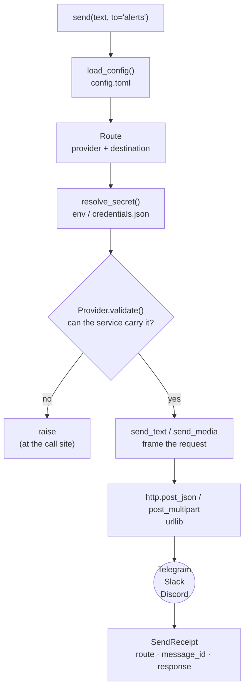
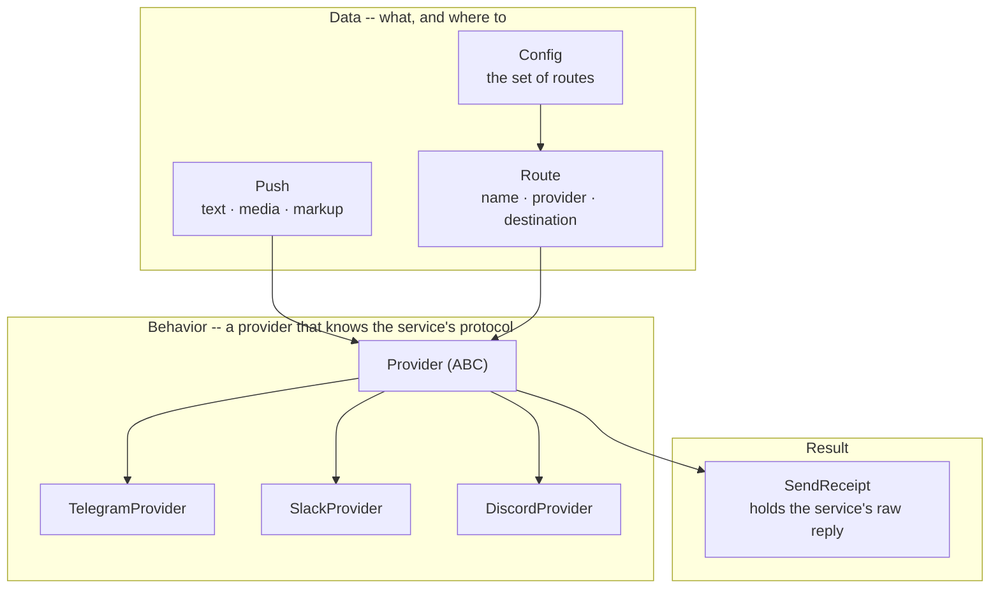

# pushpush

[](https://github.com/seokhoonj/pushpush/actions/workflows/check.yml)
[](https://pypi.org/project/pushpush/)
[](https://pypi.org/project/pushpush/)
[](https://github.com/seokhoonj/pushpush/blob/main/LICENSE)

**English** | [한국어](README.ko.md)

Send messages to Telegram, Slack, or Discord from Python. Send text and a single
file, and save the destinations you use often under a name (a *route*) so you can
call them by name.

```python
from pushpush import send

send("chip supply crash -- take a look", to="alerts")
send(media="chart.png", caption="today", to="alerts")
```

Using Claude Code? You can send just by asking, no Python needed → [Use it from Claude Code](#use-it-from-claude-code)

Works on Windows, macOS, and Linux. It installs nothing but itself -- no other
libraries come along -- and sends over the standard library's `urllib`.

## At a glance

One `send()` resolves the route, finds the secret, lets the provider frame the
request, refuses anything the service could not carry before the network is
touched, and returns the result as a `SendReceipt`.



Objects split into three roles -- the **data** you build, the **behavior** that
sends (a provider), and the **result** that comes back. A new service is one
`Provider` subclass.



## What you can send, and where

| Service | Text | File | Credential |
|---|---|---|---|
| Telegram | Yes | Yes (photo/document) | bot token + chat_id |
| Discord | Yes | Yes (webhook attachment) | webhook URL |
| Slack | Yes | Bot token only | webhook URL or bot token (xoxb) |

Slack files go only through a **bot token** (with the `files:write` scope), and
the route's `destination` must be a channel id (`C…`). An incoming webhook has no
file upload at all -- a media push on a webhook route is refused clearly with
`MediaUnsupportedError`, so send it via Telegram or Discord, or put a link in the
text.

## Requirements

- **Python 3.11 or newer.** Check with `python --version` in a terminal. (On
  Windows it may be `py --version`.)
- **A credential for the service you send to** -- a bot token or a webhook URL.
  See [4. Getting credentials](#4-getting-credentials).

## 1. Install

pushpush installs itself and nothing else -- no other libraries come along.

```sh
pip install pushpush                                        # once it is on PyPI
pip install git+https://github.com/seokhoonj/pushpush.git   # until then
```

Check it worked:

```sh
pushpush --version
```

<details>
<summary>From source (for development)</summary>

```sh
git clone https://github.com/seokhoonj/pushpush.git
cd pushpush
python -m venv .venv
source .venv/bin/activate    # Windows: .venv\Scripts\activate
pip install -e ".[dev]"
```

</details>

## 2. Configure a route

A route saves a "which service, and where" pair under a name. To send, you call
the name (`to="alerts"`). Create it at `.config/pushpush/config.toml` under your
home directory.

| | Path |
|---|---|
| macOS · Linux | `~/.config/pushpush/config.toml` |
| Windows | `C:\Users\<username>\.config\pushpush\config.toml` |

Create the folder if it does not exist. The contents:

```toml
default_route = "alerts"

[routes.alerts]
provider    = "telegram"
destination = "123456789"    # the chat_id the bot messages (the token is a secret, kept elsewhere)

[routes.team]
provider = "slack"           # a webhook needs no destination (the URL carries the channel)

[routes.trades]
provider = "discord"         # the webhook URL points to the channel too
```

Where `destination` is needed and where it is not:

- **Telegram** -- always needed. The chat_id the bot sends to.
- **Discord** -- not needed. The webhook URL already points to the channel.
- **Slack** -- a bot token (xoxb) needs a channel (`destination = "#alerts"`).
  A webhook URL does not.

If there is only one route, `default_route` can be omitted.

## 3. Store the credential

A token or webhook URL is a secret, so it lives not in the config file but in a
separate **0600-permission file**. Don't write it in plain text in a conversation
or a script -- enter it in your own terminal with `getpass`:

```sh
python -c "
from getpass import getpass
from pushpush import load_config, store_secret
route = load_config().resolve_route('alerts')
store_secret(route, getpass('secret for alerts: '))
print('stored')
"
```

It is saved to `~/.config/pushpush/credentials.json` (mode 0600). Once entered,
you are not asked again. For a container or a one-off run, you can supply it via
an environment variable instead of a file:

```sh
export PUSHPUSH_SECRET_ALERTS="bot-token-or-webhook-URL"
```

With several routes, use `PUSHPUSH_SECRET_<ROUTE>` -- a bare `PUSHPUSH_SECRET`
cannot say which route it is for, so one service's token could go to another's.

## 4. Getting credentials

### Telegram

1. In Telegram, send `/newbot` to [@BotFather](https://t.me/BotFather) to create
   a bot. At the end it gives you a **bot token** (`123456:ABC-...`) -- that is
   the secret.
2. Start a chat with your bot (a bot cannot message you first -- that is
   Telegram's rule).
3. Find the chat_id: send your bot any message, then open
   `https://api.telegram.org/bot<token>/getUpdates` and read `chat.id`. That
   number is the `destination`.

### Discord

Channel settings → Integrations → Webhooks → New Webhook → **Copy Webhook URL**.
That whole URL is the secret, and no `destination` is needed.

### Slack

- **The simple way -- webhook**: create a per-channel webhook URL at
  [Incoming Webhooks](https://api.slack.com/messaging/webhooks). The whole URL is
  the secret; no `destination`.
- **Bot token**: create an app, grant it `chat:write` (and `files:write` to send
  files), and get a bot token (`xoxb-...`). Then put the channel in `destination`
  -- a name like `#alerts` for text, or the channel id `C…` when you send files.

## Sending

```python
from pushpush import send

# text
receipt = send("market close -- KOSPI +1.2%", to="alerts")
print(receipt.message_id)

# a file (a photo goes inline, anything else as a document)
send(media="report.pdf", caption="daily report", to="alerts")

# formatting (Telegram: plain/markdown/html; Slack, Discord: plain/markdown)
send("<b>bold</b>", to="alerts", markup="html")

# without a notification sound
send("nightly batch done", to="ops", silent=True)
```

Omit `to` and it goes to `default_route`. A send needs at least one of `text` or
`media`.

### What comes back

`send` returns a `SendReceipt` -- where it went, plus **the service's whole raw
reply**:

```python
receipt = send("hi", to="alerts")
receipt.route        # "alerts"
receipt.provider     # "telegram"
receipt.message_id   # the id the service gave the message (when it returns one)
receipt.response     # the full service reply (read-only)
```

## From the shell

Installing pushpush also gives you a `pushpush` command -- a thin wrapper over
`send()` for scripts and cron.

```sh
pushpush send "deploy finished" --to slack
pushpush send --media chart.png --caption "today" --to slack
echo "batch done" | pushpush send --to slack     # text from stdin
pushpush routes                                   # list the configured routes
```

It reads the same config and secrets as the Python API. Unlike the Python call it
does not confirm before sending -- it is for automation. For an interactive,
confirm-before-send flow, use the Claude Code skill below.

## Failures are caught before sending

A message the service could not carry is stopped at the call site, before the
network -- rather than a bad send arriving later as a silent non-delivery, it
raises right there.

| Exception | When |
|---|---|
| `InvalidPushError` | nothing to send (no text, no media), a caption without media, or a destination needed but absent |
| `MediaError` / `MediaTooLargeError` | the file is missing or not a file / over the service's limit |
| `MediaUnsupportedError` | the route cannot carry a file (a Slack incoming webhook -- use a bot token) |
| `MarkupUnsupportedError` | the service does not render that markup (html is Telegram only) |
| `MissingSecretError` | the route has no secret |
| `SendFailedError` | the service was reached and refused -- a revoked token, a wrong chat_id, etc. Carries the service's own reason |
| `urllib.error.URLError` | the network itself failed -- DNS, a refused connection, a timeout |

To catch everything:

```python
import urllib.error
from pushpush import send, PushpushError

try:
    send("hi", to="alerts")
except (PushpushError, urllib.error.URLError) as err:
    print("could not send:", err)
```

## Use it from Claude Code

This repo ships a `send` skill: describe what to send in plain words ("send this
to Telegram") and it confirms the route, shows you the content, and sends only
after you approve.

The repo is its own plugin marketplace, so install it from inside Claude Code:

```
/plugin marketplace add seokhoonj/pushpush
/plugin install pushpush@pushpush
```

Then invoke it with `/pushpush:send` (or plain language). The skill calls the
`pushpush` command, so install the package too (step 1). See `skills/send/SKILL.md`.

Prefer no plugin? Symlink the skill into your skills directory and call it as
`/send`:

```sh
ln -s "$PWD/skills/send" ~/.claude/skills/send
```
